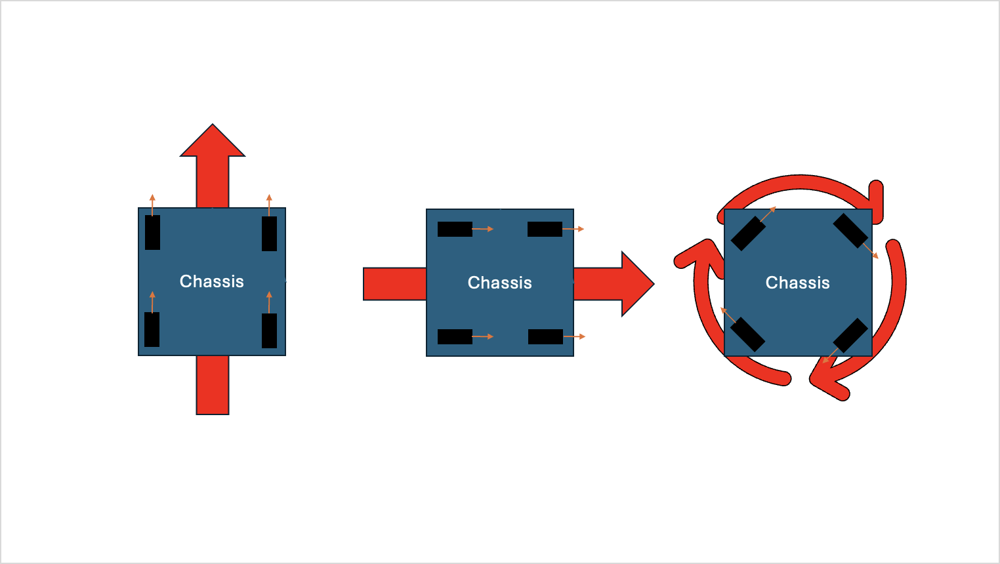

# Pure Swerve Chassis
Code for making a swerve chassis move

## Contents
- [What is swerve drve](#what-is-swerve-drive-in-frc)
- [How to program swerve](#how-to-program-swerve)  
    - [Actual code](#lets-get-to-the-actual-code)
        - [SwerveModule](#swervemodule)
            - [Optimizing a state](#optimizing-a-state)
        - [SwerveDrive](#swervedrive) 
        - [Gyro](#gyro)
        - [DriveSwerve](#driveswerve)
        - [Constants](#constants)
            - [Logging](#logging)
            - [SwerveDrive](#swervedrive-1)
                - [PhysicalModel](#physicalmodel)
            - [SwerveModules](#swervemodule-1)
    - [Autonomous](#autonomous)
        - [Odometry](#odometry)
        - [PathPLanner](#pathplanner)
        - [Adding Auto to code](#adding-auto-to-code)
- [Common problems](#common-problems)

## What is Swerve Drive in FRC
Swerve drive is a holonomic driving system. Meaning it can move in x and y direction and turn at the same time. You can see an example [here](https://youtu.be/FLnUZBHBczM?si=fxpICCj0WZetGUga&t=17).

Swerve drive works with four wheels called modules, each module has direction and speed, depending on these values the robot can move with the desired speed and direction.




## How to program swerve

Let's separate swerve drive into the key steps we need to take.

> [!NOTE]
> Swerve drive is ussualy programmed in a field relative reference frame, meaning forward will be forward no matter the rotation of the robot.

We start with the x speed, y speed and rotational speed given as input. We convert to field relative speeds using the gyroscope to get the heading and offset the speeds with that.

Using the field relative speeds we calculate the rotation and speed (Swerve Module State) of each module. 

And finally we need to set the mosules to their corresponding state

> [!IMPORTANT]
> WPILib does all this using the class `ChassisSpeeds`


<sup>Image retrieved from [FRC 0 to autnomous](https://youtu.be/0Xi9yb1IMyA?si=rVmkGVnW3SoixsAd)</sup>


### Let's get to the actual code

As we need to factor this into a Command Based Robot we will need to separate Subsystems and commands.

The first subsystem is [`SwerveModule`](src/main/java/frc/robot/subsystems/SwerveModule.java) in which the state of an individual module will be set.

The second one is [`SwerveDrive`](src/main/java/frc/robot/subsystems/SwerveDrive.java) that will be responsible for calculating the state of all modules

And the last one is [`Gyro`](src/main/java/frc/robot/subsystems/Gyro/GyroIOPigeon.java) that will give the rotation of the robot to `SwerveDrive` so it can calculate the field relative speed.

> [!IMPORTANT]
> We use an interface in case we need to switch to a navX instead of our Pigeon 2.0

And we only need one command, [`DriveSwerve`](src/main/java/frc/robot/commands/swerve/DriveSwerve.java) that will send the `xSpeed`, `ySpeed`, and `rotSpeed` to the `SwerveDrive` subsystem

> [!NOTE]
> [`ZeroHeading`](src/main/java/frc/robot/commands/swerve/ZeroHeading.java) is another command but it is only used to set the front of the robot, (the '0' value of the gyroscope)

---

#### [`SwerveModule`](src/main/java/frc/robot/subsystems/SwerveModule.java)

The `SwerveModule` subsystem is initialized with a `SwerveModuleOptions`, this is a class of our oen making and is made to help by making Constants easier to read.

[`SwerveModuleOptions`](src/main/java/lib/team3526/constants/SwerveModuleOptions.java) has 7 variables:

- `absoluteEncoderInverted` ***boolean*** whether the absolute encoder is inverted
- `driveMotorInverted` ***boolean*** whether the drive motor is inverted
- `driveMotorInverted` ***boolean*** whether the turning motor is inverted
- `driveMotorID` ***int*** the CAN ID of the drive motor
- `turningMotorID` ***int*** the CAN ID of the turn motor
- `name` ***String*** the name of the module *ex: 'front left'*

> [!IMPORTANT]
> The turning motor encoder is set to the absolute oncoder's value on intialization, this is because that encoder is not absolute and will always be 0 at start up so you need help from the absolute encoder to know its real position

On initialization (line 46) we set all the variables and reset the encoders. 

`setTargetState()` will [optimize](#Optimizing-a-state) the state and set the speed and angle of the module. the angle is set using a `SparkMaxPIDController`

##### Optimizing a state

We obtimize so the wheel takes the shortest path possible to the desired angle

> 0 degrees with speed of 1 is equal to 180 degrees with speed of -1


### [`SwerveDrive`](src/main/java/frc/robot/subsystems/SwerveDrive.java)

`SwerveDrive` is initialized with the 4 `SwerveModules`, and the `Gyro` Subsystem.

First we reset the gyroscope so the robot has the correct field relative heading using:
```
// Reset gyroscope
this.gyro.reset();
```

The `zeroHeading()` function just resets the gyro using: 
`gyro.reset();`

`getRelativeChassisSpeeds()` will return the corresponding `ChassisSpeeds` if it is driving robot relative or not. We know this with the boolean `drivingRobotRelative`

> [!IMPORTANT]
> To get the module states from `ChassisSpeeds` we use 
>```
>SwerveModuleState[] m_moduleStates = Constants.SwerveDrive.PhysicalModel.kDriveKinematics.toSwerveModuleStates(speeds);
> ```
> For this we need `SwerveDriveKinematics` initialized in [`Constants`](#Constants)

`setModuleStates()` sets the module states using a `SwerveModuleState` array.

`drive()` sets the module states from chassis speeds

For Driving we don't directly use `drive()` we use `driveFieldRelative()` or `driveRobotRelative()` depending how we need to drive, these functions also work by running them with three doubles instead of the chassis speeds.

`driveRobotRelative()` uses `drive()` directly but sets the boolean `drivingRobotRelative` to true.z

`driveFieldRelative()` uses `drive()` but passes field relative speeds using WPI: 
```
ChassisSpeeds.fromFieldRelativeSpeeds(xSpeed, ySpeed, rotSpeed, getHeading())
```
and also sets `drivingRobotRelative` to false.

`stop()` sets all the module speeds to 0

`xFormation()` sets the wheels on an 'x' for a more efficient brake.

> [!NOTE]
> All autonomous related functions will be explained [later](#odometry)  
> For example odometry:
> ```
> this.odometry = new SwerveDriveOdometry(
>         Constants.SwerveDrive.PhysicalModel.kDriveKinematics,
>         this.getHeading(),
>         new SwerveModulePosition[]{
>             frontLeft.getPosition(),
>             frontRight.getPosition(),
>             backLeft.getPosition(),
>             backRight.getPosition()
>         }
>     );
> ```

### [`Gyro`](src/main/java/frc/robot/subsystems/Gyro/GyroIOPigeon.java)

> [!NOTE]
> For the gyro we use an [interface](https://www.w3schools.com/java/java_interface.asp) we do this to make the gyro device changable in just one line of code, you have the subsystem that you use in code [`Gyro.java`](src/main/java/frc/robot/subsystems/Gyro/Gyro.java) and the interface [`GyroIO.java`](src/main/java/frc/robot/subsystems/Gyro/GyroIO.java) and the actual Devices are [`GyroIOPigeon`](src/main/java/frc/robot/subsystems/Gyro/GyroIOPigeon.java) for pigeon and [`GyroIONavX`](src/main/java/frc/robot/subsystems/Gyro/GyroIONavX.java) for the NavX. To instantiate a gyro you use:
> ```
> new Gyro(new GyroIOPigeon(kGyroDevice)); // pigeon
> new Gyro(new GyroIONavx()) // NavX
> ```

For the gyroscope you only need the heading of the Robot


### [`DriveSwerve`](src/main/java/frc/robot/commands/swerve/DriveSwerve.java)

`DriveSwerve` is the command used to drive. You pass you controller inputs as a `Suplier` this command only applies deadzone
```
x = Math.abs(x) < Constants.SwerveDrive.kJoystickDeadband ? 0 : x;
y = Math.abs(y) < Constants.SwerveDrive.kJoystickDeadband ? 0 : y;
rot = Math.abs(rot) < Constants.SwerveDrive.kJoystickDeadband ? 0 : rot;
```
applies the `SlewRateLimiter`
```
x = xLimiter.calculate(x);
y = yLimiter.calculate(y);
rot = rotLimiter.calculate(rot);
```
Scales it up to the robot speeds (controller is -1 to 1 robot is 5m/s max) so x speed of 1 in the controller is robot speed of 5 m/s
```
x *= Constants.SwerveDrive.PhysicalModel.kMaxSpeed.in(MetersPerSecond);
y *= Constants.SwerveDrive.PhysicalModel.kMaxSpeed.in(MetersPerSecond);
rot *= Constants.SwerveDrive.PhysicalModel.kMaxAngularSpeed.in(RadiansPerSecond);
```
and drives in either robot relative or field relative mode depending on an input in the controller
```
if (this.fieldRelative.get()) {
    swerveDrive.driveFieldRelative(x, y, rot);
} else {
    swerveDrive.driveRobotRelative(x, y, rot);
}
```

<!-- TODO -->
### [`Constants`](src/main/java/frc/robot/Constants.java)
In Java, a `Constants` class is often used to store and organize various constant values that are used throughout the project. These are initialized as final.

#### Logging
The `Logging` class just contains a boolean that will activate debug logging

#### SwerveDrive


##### PhysicalModel


#### SwerveModule

## Autonomous

### Odometry

### PathPlanner

### Adding Auto to code

# Common Problems